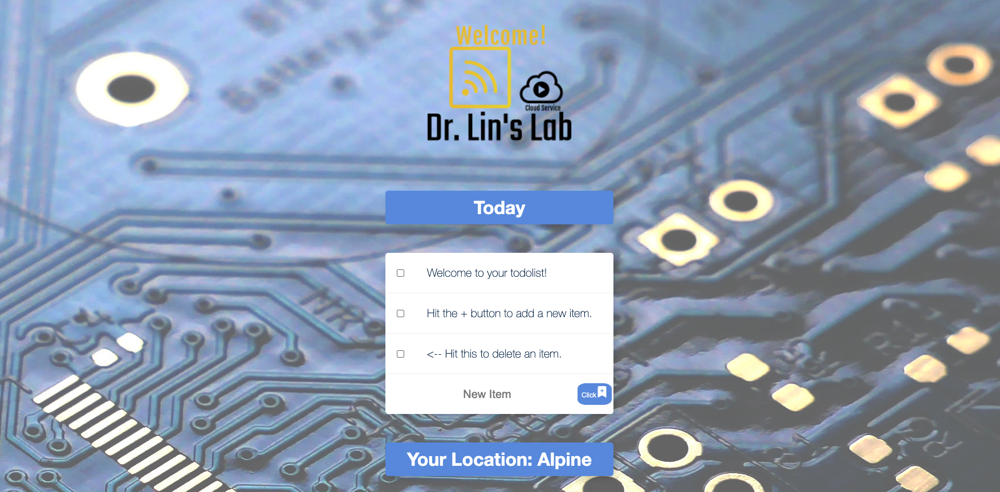
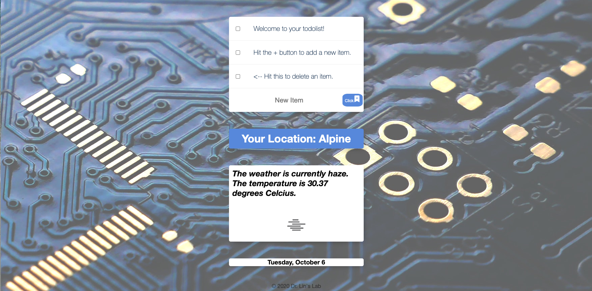
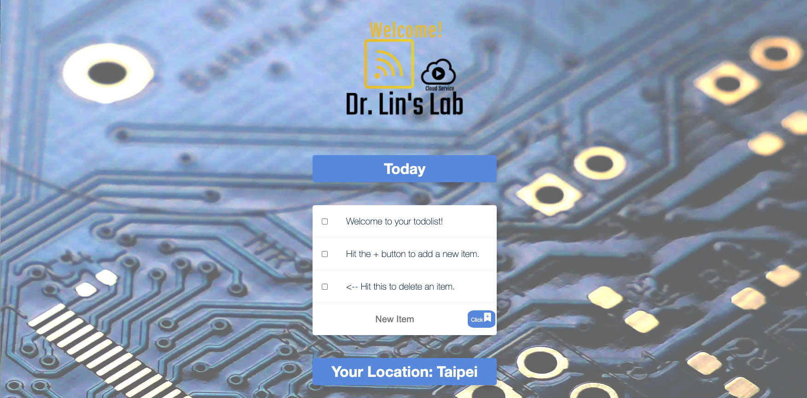
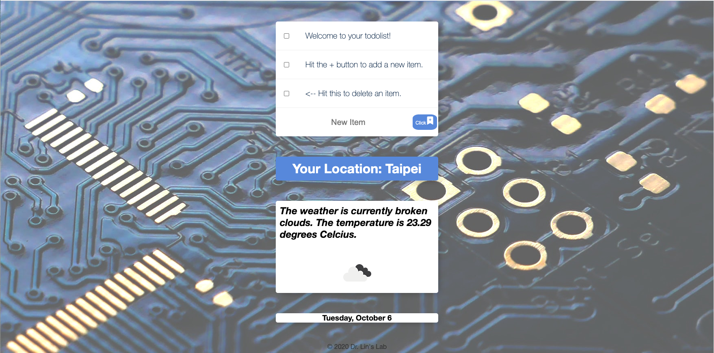
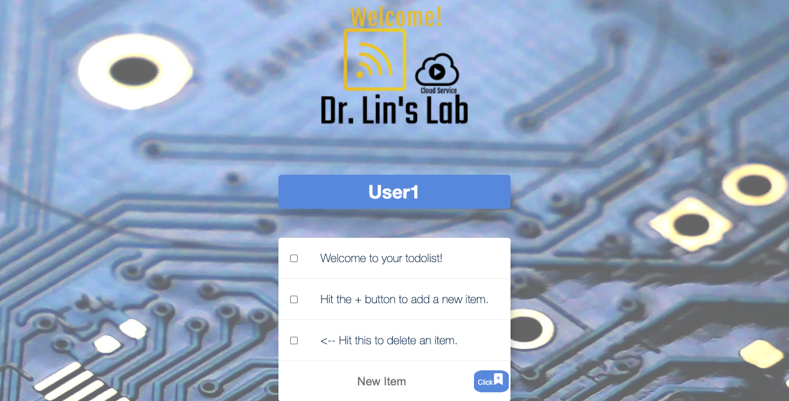

# Online-to-do-list-service

An online to do list system using APIs, MongoDB and hosted on Heroku
Please refer to the link for display: https://intense-ocean-50308.herokuapp.com/

Step 1: Hit the + button to add a new item. Hit the check box to delete an item.

Step 2: The website will show your location, the weather, and The temperature.

The location changes with different users.

The weather changes with different users.

Add a name after the webiste address will bring up a customized to-do-ist.

A customized to-do-ist is generated.

